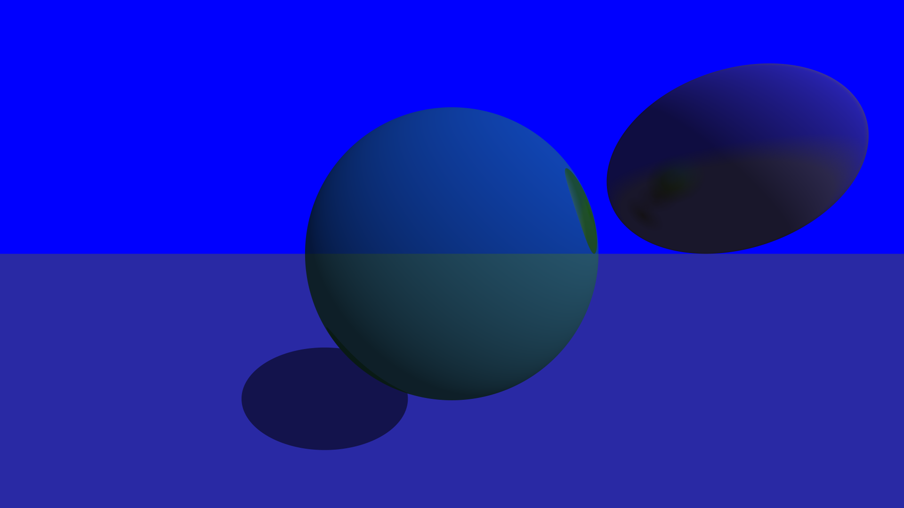
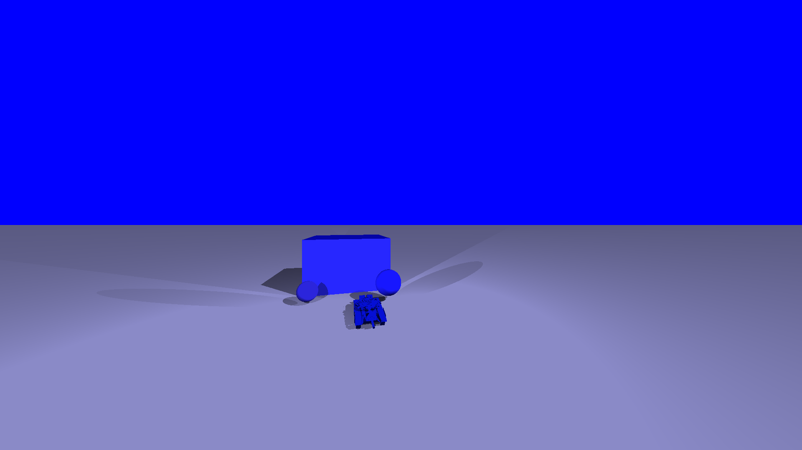
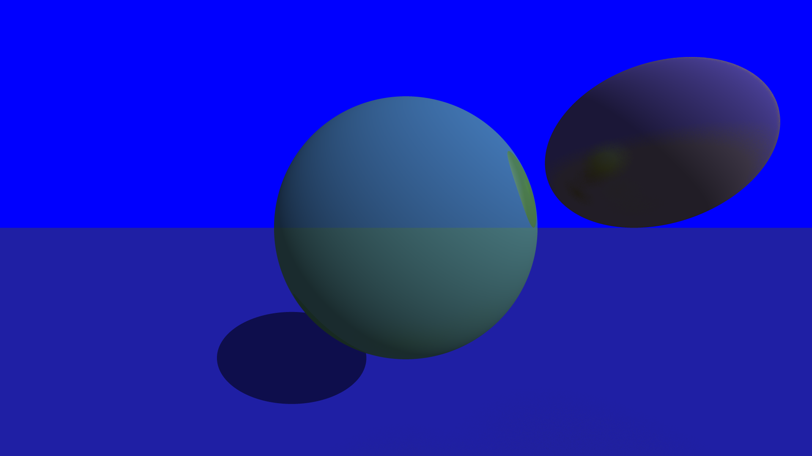
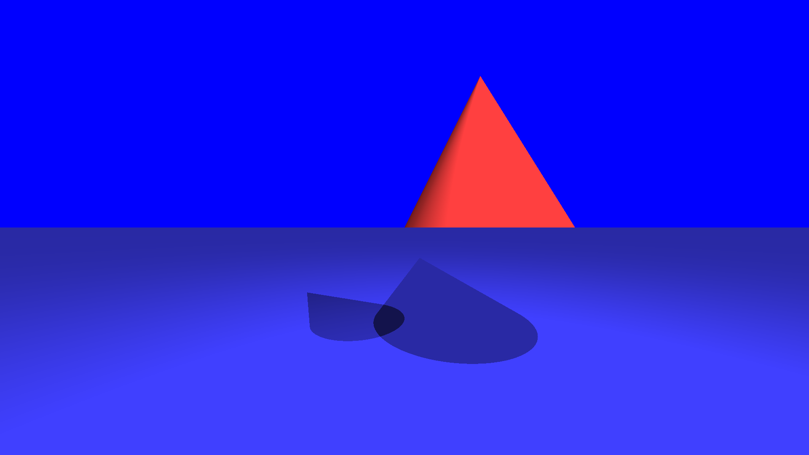
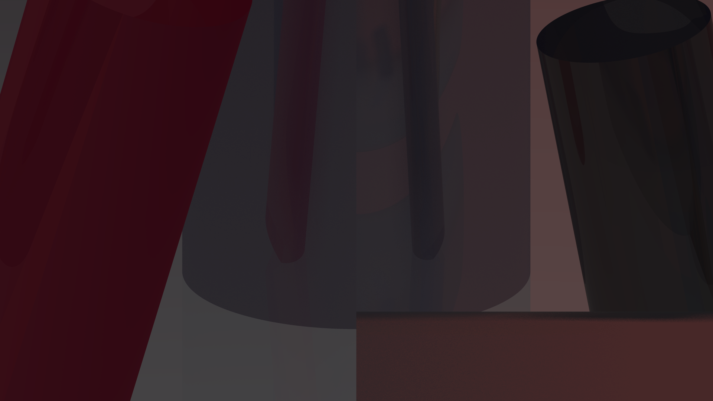
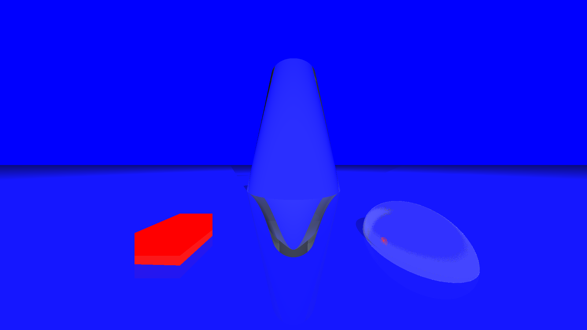
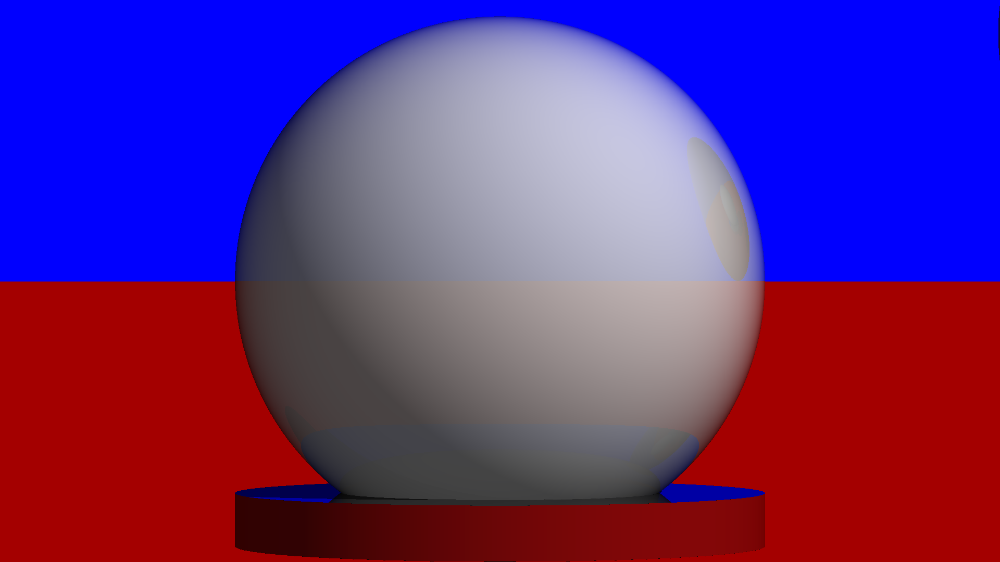
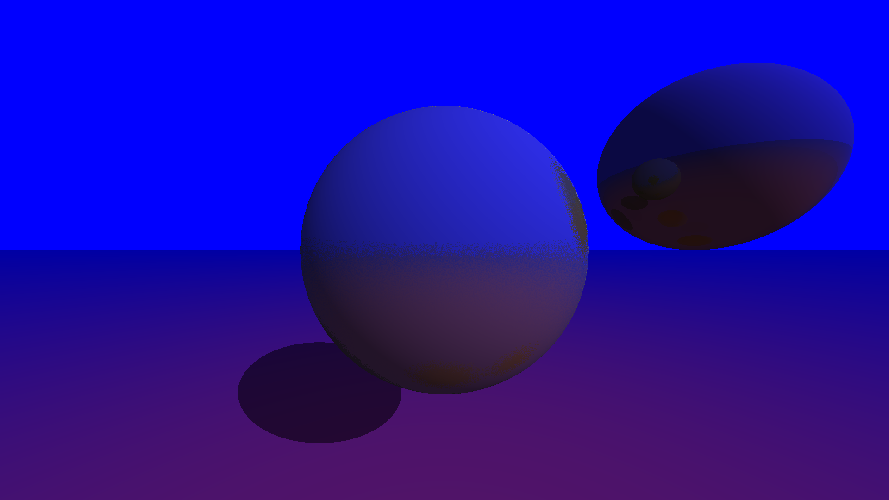

# RayTracer 🖼️🔆

A sophisticated, physically-based CPU raytracer implemented in C++ that produces photorealistic images by simulating the path of light through a 3D scene. This project implements core graphics algorithms including ray-primitive intersections, physically-based materials, lighting models, and optimization techniques.

```ascii

██████╗  █████╗ ██╗   ██╗████████╗██████╗  █████╗  ██████╗███████╗██████╗ 
██╔══██╗██╔══██╗╚██╗ ██╔╝╚══██╔══╝██╔══██╗██╔══██╗██╔════╝██╔════╝██╔══██╗
██████╔╝███████║ ╚████╔╝    ██║   ██████╔╝███████║██║     █████╗  ██████╔╝
██╔══██╗██╔══██║  ╚██╔╝     ██║   ██╔══██╗██╔══██║██║     ██╔══╝  ██╔══██╗
██║  ██║██║  ██║   ██║      ██║   ██║  ██║██║  ██║╚██████╗███████╗██║  ██║
╚═╝  ╚═╝╚═╝  ╚═╝   ╚═╝      ╚═╝   ╚═╝  ╚═╝╚═╝  ╚═╝ ╚═════╝╚══════╝╚═╝  ╚═╝                                    
```

## 🖼️ Gallery

Here are some examples of scenes rendered with this raytracer:

<p align="center">
  
  <br><em>High Quality Render - Showcasing advanced materials and lighting</em>
</p>

<p align="center">
  
  <br><em>Tank Scene - Complex geometry with reflective surfaces</em>
</p>

<p align="center">
  
  <br><em>Composite Materials - Demonstrating material blending</em>
</p>

<p align="center">
  
  
  <br><em>Geometric Primitives - Cones and Cylinders with realistic lighting</em>
</p>

<p align="center">
  
  <br><em>Custom Scene - Multiple primitives and materials</em>
</p>

<p align="center">
  
  <br><em>Glass Material - Realistic refraction with Fresnel effects</em>
</p>

<p align="center">
  
  <br><em>Reflective Spheres - Mirror materials with ambient lighting</em>
</p>

---

## ✨ Key Features

### 🚀 Rendering Engine
- **Recursive raytracing** with configurable maximum ray depth
- **Supersampling anti-aliasing** for smooth edges
- **Multi-threaded rendering** with automatic core detection and load balancing
- **Scene preview** with fast rendering mode for quick adjustments
- **Progress monitoring** with real-time statistics including rays/second

### 📐 Geometric Primitives
- **Sphere**: With full transformation support
- **Plane**: Infinite planes on primary axes
- **Cylinder**: Both infinite and height-limited variants
- **Cone**: With configurable apex angle and optional height limiting
- **Cube/Box**: With transformation support
- **Triangle**: Basic building block for more complex meshes
- **OBJ file import**: Support for loading complex models from OBJ files

### 🎨 Advanced Material System
- **Matte (Diffuse)**: Basic Lambertian diffuse material
- **Mirror**: Perfect specular reflection with configurable reflectivity
- **Glass**: Full refraction with physical properties and Fresnel effects
- **Metal**: Realistic metal with configurable roughness parameters
- **Translucent**: Semi-transparent materials with partial transmittance
- **Diamond**: High-end material with dispersion effects for realistic gems
- **Composite**: Material blending system that combines multiple material types with weights

### 💡 Physically-Based Lighting
- **Directional lights**: Simulating light sources at infinity (like sunlight)
- **Point lights**: Local light sources with distance-based attenuation
- **Ambient lighting**: For basic global illumination approximation
- **Phong reflection model**: For realistic specular highlights
- **Drop shadows**: Computed through ray-casting
- **Fresnel effects**: Angle-dependent reflection/refraction calculations

### 🔄 Transformations
- **Translation**: Moving objects in 3D space
- **Rotation**: Around arbitrary axes
- **Transform hierarchies**: Basic scene graph structure

### 🖥️ Interactive UI
- **Scene browser**: Browse and select from available scene files
- **Parameter adjustment**: Real-time modification of render settings:
 - Refraction level
 - Supersampling quality
- **Immediate visual feedback**: See changes without restarting the renderer
- **Statistics display**: Performance metrics during and after rendering

## 🏗️ Technical Architecture

The project is built with a focus on extensibility, maintainability, and performance:

### 🧩 Design Patterns
- **Factory Pattern**: Implemented for materials, primitives, and lights to allow runtime creation of objects
- **Builder Pattern**: Used for scene construction with a fluent interface
- **Composite Pattern**: For complex materials and hierarchical scene structure

### 🔌 Component Architecture
- **Interface-based design**: Core components are connected through well-defined interfaces
- **Separation of concerns**: Rendering logic separate from scene representation
- **Plugin-ready architecture**: Framework supports dynamic loading of new primitives and materials

### ⚡ Optimizations
- **Multi-threading**: Parallel rendering of different image regions
- **Ray statistics**: Detailed tracking of ray counts and performance metrics
- **Early rejection**: Fast path testing to skip unnecessary computation

## 📁 Project Structure

```
src/
├── builders/
│   ├── SceneBuilder.cpp
│   ├── SceneBuilder.hpp
│   ├── SceneLoader.cpp
│   └── SceneLoader.hpp
├── core/
│   ├── AmbiantLight.hpp
│   ├── Camera.cpp
│   ├── Camera.hpp
│   ├── Cone.cpp
│   ├── Cone.hpp
│   ├── Cube.cpp
│   ├── Cube.hpp
│   ├── Cylinder.cpp
│   ├── Cylinder.hpp
│   ├── CylinderOptimizations.hpp
│   ├── DirectionalLight.hpp
│   ├── Plane.cpp
│   ├── Plane.hpp
│   ├── Point3D.cpp
│   ├── Point3D.hpp
│   ├── PointLight.hpp
│   ├── Ray.cpp
│   ├── Ray.hpp
│   ├── Rectangle3D.cpp
│   ├── Rectangle3D.hpp
│   ├── Scene.hpp
│   ├── Sphere.cpp
│   ├── Sphere.hpp
│   ├── Triangle.cpp
│   ├── Triangle.hpp
│   ├── Vector3D.cpp
│   └── Vector3D.hpp
├── factories/
│   ├── LightFactory.hpp
│   ├── MaterialFactory.hpp
│   └── PrimitiveFactory.hpp
├── interfaces/
│   ├── APrimitive.hpp
│   ├── ATransformable.hpp
│   ├── ILight.hpp
│   ├── IMaterialInteraction.hpp
│   └── IPrimitive.hpp
├── main.cpp
├── material/
│   ├── AMaterial.cpp
│   ├── AMaterial.hpp
│   ├── CompositeMaterial.cpp
│   ├── CompositeMaterial.hpp
│   ├── DiamondMaterial.cpp
│   ├── DiamondMaterial.hpp
│   ├── GlassMaterial.cpp
│   ├── GlassMaterial.hpp
│   ├── IMaterial.cpp
│   ├── IMaterial.hpp
│   ├── MatteMaterial.cpp
│   ├── MatteMaterial.hpp
│   ├── MetalMaterial.cpp
│   ├── MetalMaterial.hpp
│   ├── MirrorMaterial.cpp
│   ├── MirrorMaterial.hpp
│   ├── TranslucentMaterial.cpp
│   └── TranslucentMaterial.hpp
├── renderer/
│   ├── LightRenderer/
│   │   ├── LightRenderer.cpp
│   │   └── LightRenderer.hpp
│   ├── PrimitiveRenderer/
│   │   ├── PrimitiveRenderer.cpp
│   │   └── PrimitiveRenderer.hpp
│   ├── Renderer.cpp
│   └── Renderer.hpp
├── ui/
│   ├── DisplayManager.cpp
│   ├── DisplayManager.hpp
│   ├── EventManager/
│   │   ├── EventManager.cpp
│   │   └── EventManager.hpp
└── utils/
    ├── Debug.cpp
    ├── Debug.hpp
    ├── Timer.cpp
    └── Timer.hpp
```

## 🛠️ Building and Dependencies

### 📋 Prerequisites
- C++17 compatible compiler (GCC 8+, Clang 7+, MSVC 2019+)
- [libconfig++](https://hyperrealm.github.io/libconfig/) (for scene file parsing)
- [SFML 2.5+](https://www.sfml-dev.org/) (for display and UI)
- Make for building

### 🔨 Building with Make
```bash
# Clone the repository
git clone https://github.com/EpitechPromo2028/B-OOP-400-TLS-4-1-raytracer-loris.gode.git
cd B-OOP-400-TLS-4-1-raytracer-loris.gode

# Build the project
make

# Build with debug symbols
make debug

# Run unit tests
make tests_run

# Clean build files
make clean

# Remove all generated files
make fclean

# Rebuild everything
make re
```

## 📝 Usage Examples

### 🔍 Basic Usage

```bash
# Render a scene to output.ppm
./raytracer scenes/demo_sphere.txt

# Launch with interactive UI
./raytracer -i
```

### 🔧 Advanced Options

```bash
# Show help
./raytracer -h

# Render with 4 samples per pixel (anti-aliasing)
./raytracer -s 4 scenes/demo_sphere.txt

# Render with 8 maximum ray depth (for complex refractions/reflections)
./raytracer -r 8 scenes/demo_glass.txt

# Enable debug mode with verbose output
./raytracer -d scenes/complex_scene.txt
```

## 📄 Scene Configuration File Format

The raytracer uses libconfig++ format for scene definitions. Here's a comprehensive example:

```txt
# Camera configuration
camera:
{
    resolution = { width = 1920; height = 1080; };
    position = { x = 0; y = -100; z = 20; };
    rotation = { x = 0; y = 0; z = 0; };
    fieldOfView = 72.0; # In degrees
};

# Scene primitives
primitives:
{
    # List of spheres
    spheres = (
        { 
            x = 60; y = 5; z = 40; 
            r = 25; 
            material = {
                type = "glass";
                color = { r = 255; g = 255; b = 255; };
                transparency = 0.95;
                refractionIndex = 1.5;
            };
            transforms = {
                translation = { x = 0; y = 0; z = 0; };
                rotation = { x = 0; y = 0; z = 0; };
            };
        },
        { 
            x = -40; y = 20; z = -10; 
            r = 35; 
            material = {
                type = "metal";
                color = { r = 220; g = 220; b = 210; };
                roughness = 0.1;
                reflectivity = 0.8;
            };
        }
    );
    
    # List of planes
    planes = (
        { 
            axis = "Z"; 
            position = -20; 
            material = {
                type = "matte";
                color = { r = 180; g = 180; b = 200; };
            };
        }
    );
    
    # Cylinders
    cylinders = (
        {
            x = 0; y = 0; z = 0;
            r = 10;
            height = 30;
            axis = { x = 0; y = 1; z = 0; };
            material = {
                type = "mirror";
                color = { r = 220; g = 220; b = 255; };
                reflectivity = 0.7;
            };
        }
    );
};

# Light configuration
lights:
{
    # Ambient light level (0.0 - 1.0)
    ambient = 0.3; 
    
    # List of directional lights
    directional = (
        { 
            x = 1; y = -1; z = 0; 
            intensity = 0.7;
            shading_model = 1; # 0 = None, 1 = Phong
        }
    );
    
    # List of point lights
    point = (
        { 
            x = 400; y = 100; z = 500;
            intensity = 0.8;
            attenuation = 0.001;
        }
    );
};

# OBJ file import
objects: (
    {
        file = "models/teapot.obj";
        position = { x = 20; y = 0; z = 0; };
        material = {
            type = "diamond";
            color = { r = 255; g = 255; b = 255; };
            transparency = 0.9;
            reflectivity = 0.2;
            refractionIndex = 2.4;
            dispersion = 0.044;
        };
    }
);
```

### 🔍 Advanced Usage

### 🧪 Creating Custom Materials

Materials can be combined using the composite material type:

```txt
material = {
    type = "composite";
    color = { r = 200; g = 200; b = 200; };
    materials = (
        {
            type = "metal";
            color = { r = 255; g = 220; b = 220; };
            weight = 0.7;
            roughness = 0.1;
        },
        {
            type = "glass";
            color = { r = 255; g = 255; b = 255; };
            weight = 0.3;
            transparency = 0.9;
            refractionIndex = 1.5;
        }
    );
};
```

## ⚡ Performance Tuning

For complex scenes, tune performance by adjusting:

- **Ray depth** (`-r` option): Higher values for better reflections/refractions, but slower rendering
- **Supersampling** (`-s` option): Higher values for better anti-aliasing, but slower rendering
- **Scene complexity**: Simplify geometry for faster preview renders
- **Multi-threading**: Automatically utilizes available CPU cores

## 👥 Contributors

- [Marc Grioche](https://github.com/marcgrioche)
- [Loris Gode](https://github.com/LorisDXB)
- [Perrine Feyt](https://github.com/pepsicoo)
- [Gobijan Nathakrishnan](https://github.com/GobyNathan)

## 📜 License

This project is licensed under the MIT License - see the LICENSE file for details.

## 🙏 Acknowledgements

Inspired by classic raytracing texts including:

- "Ray Tracing in One Weekend" by Peter Shirley
- "Physically Based Rendering" by Matt Pharr, Wenzel Jakob, and Greg Humphreys

## 🔮 Future Improvements

- Implement BVH (Bounding Volume Hierarchy) for further performance optimization
- Add texture mapping and normal mapping
- Support for area lights and soft shadows
- Bidirectional path tracing for global illumination
- Support for procedural textures (noise, patterns)

---

*This project demonstrates advanced C++ programming techniques, 3D graphics algorithms, and software architecture principles. The raytracer is designed to be both educational and practical, serving as a foundation for more sophisticated rendering systems.* ✨